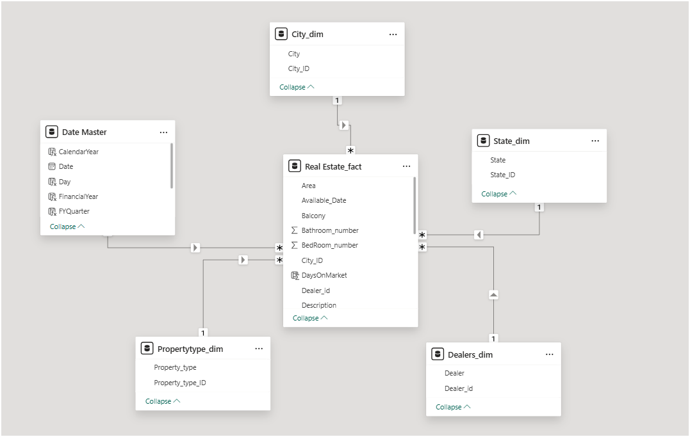
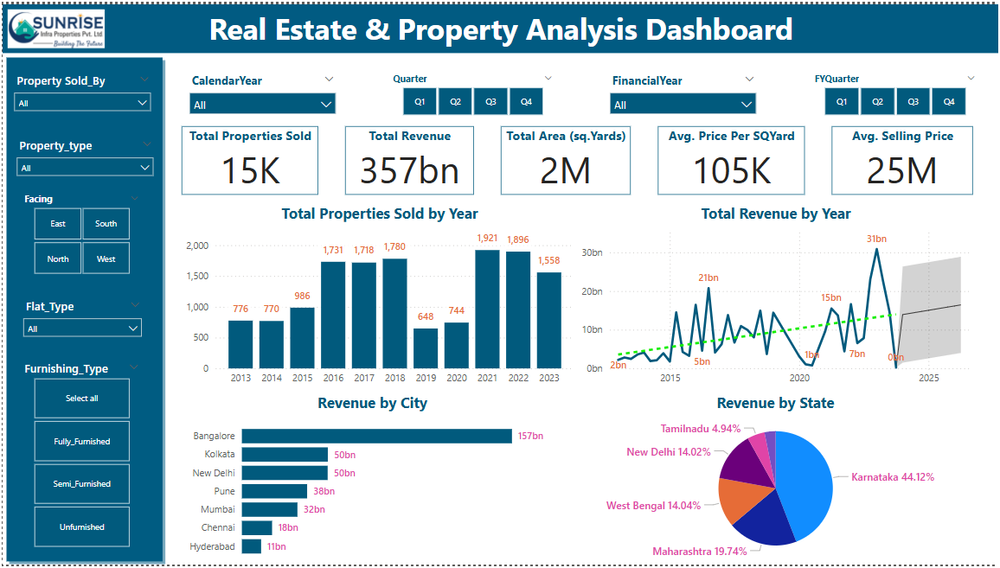
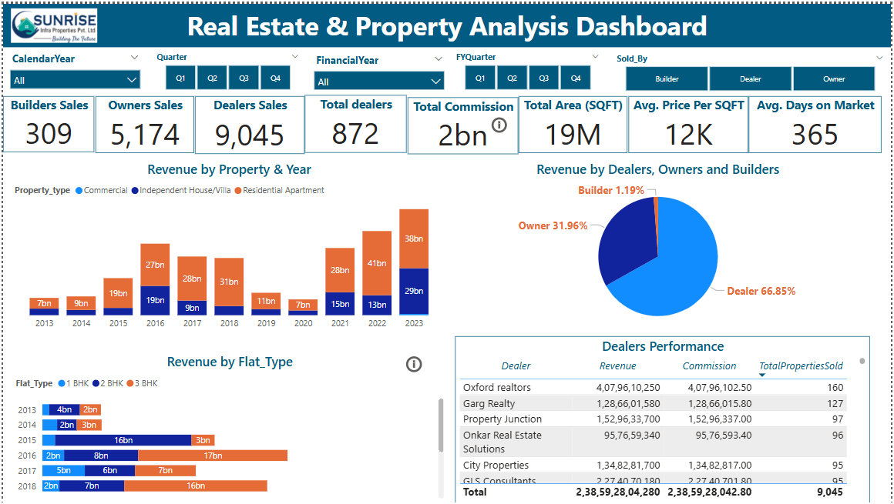

# Real Estate and Property Analysis
 This Power BI dashboard analyzes real estate trends, pricing, dealer performance, and investment opportunities across Indian cities over the past decade. Built using Power Query & a star schema, it provides interactive insights with KPIs, visuals & slicers.

## Project PDF
[View PDF](https://1drv.ms/b/c/8673476679b39335/IQRVkc8mdWHCSqu-dnTL1gY3ARda8sfaSAmivf0oP2mtlAY)

## Project Components
- Power BI: Employed to create interactive dashboards and reports, including property and performance.
- DAX: Used for creating KPIs and calculating performance metrics.
- Data Transformation: Raw data is cleaned, transformed, and structured for analysis and reporting.

## Features
- Interactive Dashboards: Created Power BI dashboards with dynamic charts, page navigation, and conditional formatting
- Advanced Power BI Features: Implemented complex DAX formulas, buttons, and slicers for improved user experience.

## Technologies Used
- Power BI
- DAX
- Power Query

##Data Model

## Property Analysis

## Performance

